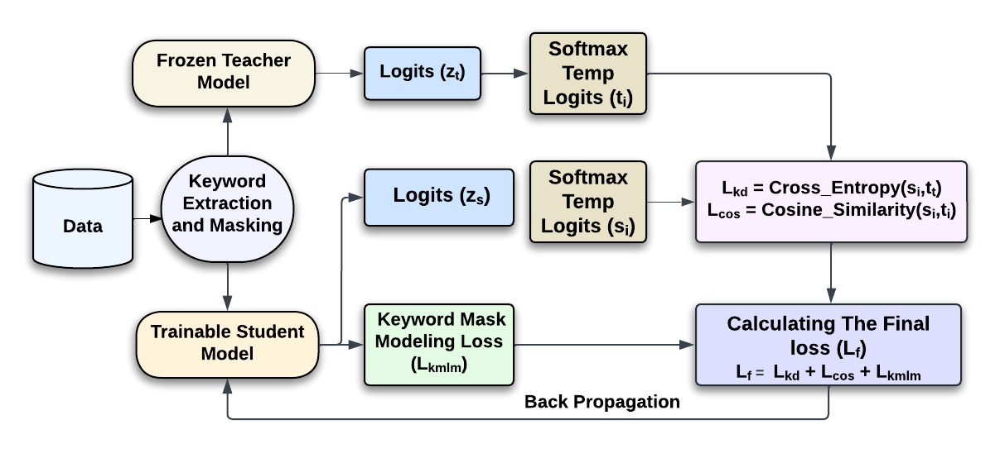

# Keyword Knowledge Distilation (KKD)



## Instructions to run the code

### Required directory structure to save the results:

```
+-- workspace/
  |    fin/
  |   +-- data/
  |   +-- results/
  |   |   +--dis-kd-1.csv
  |   |   +--dis-kd-steps-1.csv
  |   |   ...
  |   +-- models/
  |   |   +--student-1.pth
  |   |   ...
  |   +-- downstream/
  |   |   +--fiph/
  |   |   ...
  |   |   ...
  |    legal/
  |   +-- data/
  |   +-- results/
  |   |   +--dis-kd-1.csv
  |   |   +--dis-kd-steps-1.csv
  |   |   ...
  |   +-- models/
  |   |   +--student-1.pth
  |   |   ...
  |   +-- downstream/
  |   |   +--ecthr_a/
  |   |   +--ecthr_b/
  |   |   ...

```

### Install the required packages:

```
pip install --upgrade pip
pip install torch==2.0.1
pip install datasets==2.16.1
pip install scikit-learn numpy pandas
pip install transformers==4.30
pip install -q -U trl accelerate git+https://github.com/huggingface/peft.git
pip install -q bitsandbytes einops sentencepiece
pip install evaluate seqeval
pip uninstall -y apex
pip install keybert

```
### Run the commands for KKD training

```
python fin_kkd_student.py
python legal_kkd_student.py
```
Available arguments:
- `--b`: Batch size. Default = 32
- `--e`: Current number of epoch . Default = 1
- `--cl`: Input sequence length of the Teacher and Student model . Default = 512
- `--l1`: Learning rate for training. Default = 0.00001
- `--n`: Total no of samples in the dataset. Default = 1200000


### Run the commands for the downstreaming tasks for Legal Domain

```
python legal_down_streaming/ecthr_a.py
python legal_down_streaming/ecthr_b.py
python legal_down_streaming/scotus.py
python legal_down_streaming/ledger.py
python legal_down_streaming/unfair-tos.py
python legal_down_streaming/eurlex.py
python legal_down_streaming/case_hold.py
python legal_down_streaming/e-ner.py
python legal_down_streaming/policy-qa.py


```

Available arguments for ecthr_a, ecthr_b and scotus :

- `--b`: Batch size. Default = 8
- `--e`: Current number of epoch . Default = 20
- `--ms`: Paragraph Length . Default = 32
- `--l`: Learning rate for training. Default = 0.00003
- `--s`: Random seed


Available arguments for ledger, unfair-tos, eurlex and case_hold :

- `--b`: Batch size. Default = 8
- `--e`: Current number of epoch . Default = 20
- `--l`: Learning rate for training. Default = 0.00003
- `--s`: Random seed

Available arguments for policy-qa

- `--e`: Initial number of epochs. Default = 1  
- `--t`: Total number of epochs. Default = 10  
- `--b`: Batch size. Default = 16  
- `--l`: Learning rate for training. Default = 0.00003  
- `--s`: Random seed for reproducibility. Default = 1

Available arguments for e-ner

- `--e`: Total number of epochs. Default = 100  
- `--b`: Batch size. Default = 8  
- `--l`: Learning rate for training. Default = 0.00003  
- `--s`: Random seed for reproducibility. Default = 1


### Run the commands for the downstreaming tasks for Finance Domain

```
python fin_down_streaming/fiqa.py
python fin_down_streaming/fiph.py
python fin_down_streaming/fin-ner.py

```


Available arguments for fiph :

- `--b`: Batch size. Default = 64
- `--e`: Current number of epoch . Default = 25
- `--l`: Learning rate for training. Default = 2*0.00001
- `--n`: Number of K-fold. Default = 10
- `--t`: 1 := 100-percent, else := ALL-DATA
- 


Available arguments for fiqa :

- `--b`: Batch size. Default = 64
- `--e`: Current number of epoch . Default = 25
- `--l`: Learning rate for training. Default = 2*0.00001
- `--n`: Number of K-fold. Default = 10

Available arguments for fin-ner :

- `--e`: Total number of epochs. Default = 50  
- `--b`: Batch size. Default = 8  
- `--l`: Learning rate for training. Default = 0.00001  
- `--s`: Random seed for reproducibility. Default = 1
